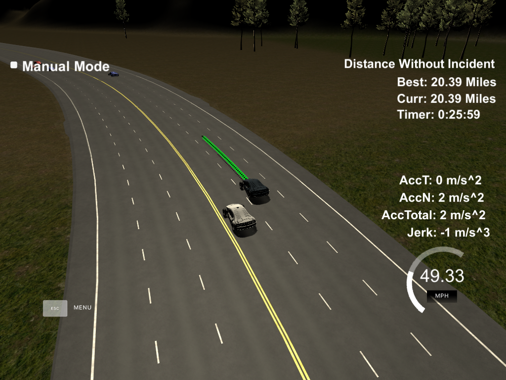

# UDACITY Self-Driving Car Nanodegree Program
## Path-Planning for Self Driving Cars

  In this repo, I present my submission for the path-planning project of the Self-Driving Car Nanodegree Program. The code is intended to attain a navigation behavior similar to a cautious, and yet efficient, driver. The figure below depicts the result of this navigation approach in the [simulator](https://github.com/udacity/CarND-Path-Planning-Project) provided in the Self-Driving Car Nanodegree Program. From this illustration, it can be clearly observed that the presented navigation model was able to guide the self-driving car safely and without incidents through 20.4 miles during 26 minutes with an average speed of 47 MPH approximately.



### Model Documentation

#### Performance Limitations

  To comply with the performance limitation imposed on the ego vehicle, the velocity is bounded within the range 0-49.5 MPH, as illustrated in the code below (main.cpp 177-202)
```cpp
ref_vel += delta_ref;
if(ref_vel > 49.5){
  ref_vel = 49.5;        
}else if(ref_vel < 0){
  ref_vel = 0;
}
```
  Besides, the change in the reference velocity (ref_vel) per sampling time, i.e., acceleration, is also constrained in the speed control functions as (ego_.h 78-118)
```cpp
if(delta_ref>1.115){
  delta_ref = 1.115 ;
}else if(delta_ref<-1.125){
  delta_ref = -1.125;
}
```
  In addition, the path is generated based on spline fitting considering previous path and new waypoints to guarantee a smooth navigation (See main.cpp 204-295). The new waypoints are generated evenly spaced at a dynamically adjusted distance to ensure maneuverability at low speeds. Such an adjustment is carried out as indicated below (main.cpp 241)
```cpp
double delta_s = 30 + round(25/(1 + exp(25 - 2.24 * car_.speed)));
```
#### Safe and Efficient Navigation

  To avoid collision with other vehicles while guaranteeing an efficient navigation, i.e., with an average speed close to the speed limit, three navigation modes or states are defined:
  
1. Efficient Cruising (EC): This mode operates when either there is no vehicle ahead or, the vehicle ahead is further than three times a prescribed critical distance. The acceleration of the ego vehicle is constant until reaching the maximum speed.

2. Keep Lane (KL): This navigation state is activated when the vehicles ahead are within three times the prescribed critical distance. In this mode, the traffic scenario is continuously assessed to determine the most favorable action for a higher average speed without compromising the safety of drivers. In a platoon formation, the distance to the vehicle ahead is kept fixed at the prescribed critical distance by regulating the ego vehicle velocity with a simple PD controller (ego_.h 78-97).

3. Maneuver Through Traffic (MTT): After several seconds of platooning on either lane 0 (inner) or lane 2 (outer), this mode is enabled to increase the possibility of finding a gap to gain more speed. The principle of the maneuver is to allow more headway with respect to the vehicle ahead so as to attain a more favorable condition for changing lanes to overtake the platoon formation. This mode utilizes the PD controller shown below (ego_.h 99-118).
```cpp
double MTT_cruise_control(vector<near_vehicle>& same_lane_ahead, EGO_& car_){
  double crit_distance = 20 + exp(car_.time_in_pl/1000 - 1); // Distance from the vehicle ahead is adjusted according to the elapse time in platooning navigation so as to increase the possibility of attaining a gap for changing lane
  double es_ = 0.;
  double es_dot = 0.;
  double delta_ref = 0.224;

  // PID Speed controller
  double check_s = same_lane_ahead[0].s + 0 * (same_lane_ahead[0].speed.back() - car_.speed);
  es_ = (crit_distance - (check_s - car_.s));
  es_dot = same_lane_ahead[0].speed.back() - car_.speed;
  delta_ref = - 0.025*es_ + 0.125*es_dot;

  if(delta_ref>1.115){
    delta_ref = 1.115 ;
  }else if(delta_ref<-1.125){
    delta_ref = -1.125;
  }
  return delta_ref;
}
```
In the two latter navigation modes, the traffic conditions are evaluated every 1 second to check for the availability of a navigation action that could potentially lead to a higher average speed. These navigation actions are established as Keep Lane (KL), Change Lane Left (CLL), and Change Lane Right (CLR). To grade the potential advantage of each action, several cost functions are implemented (ego_.h 134-238):

+ Efficiency cost: This function evaluates the average speed of the vehicles ahead of the ego vehicle and linearly assigns a cost between -1 and 1 to grade how close is this average speed to the speed limit of the expressway. (ego_.h 144-148)
+ Safety cost: This function penalizes changing lanes regarding the closest vehicles ahead and behind. It projects the states of the ego vehicle and surrounding vehicles 1.5 sec ahead to calculate the time-to-collision. The cost of this function is between 0 (safe maneuver) and 1 (unsafe maneuver). (ego_.h 150-184)
+ Lane cost: It penalizes changing lanes out of the admissible range (0-2). The cost output is 0 if the next lane is between 0 and 2, or 1 conversely. (ego_.h 186-197)
+ Potential advantage cost: This function is implemented to evaluate the potential advantage of changing to the middle lane when traveling either on the inner lane or the outer lane. It considers the efficiency and safety cost functions (to assess the furthest lane) to grade such a potential advantage. (ego_.h 199-226)
+ Lane occupancy cost: It grades a lane according to the number of vehicles ahead of the ego vehicle. (ego_.h 228-238)

Then, the potential advantage of each action is calculated as indicated in the code lines 255 (KL), 272 (CLL), and 289 (CLR) of ego_.h.

Note that under certain scenarios, the maneuver in MTT mode may not be effective, and hence, the implementation of a path planning approach based on JMT with the goal define following the recently introduce [SIEP concept](http://ieeexplore.ieee.org/document/8107723/) may result more effective. 
